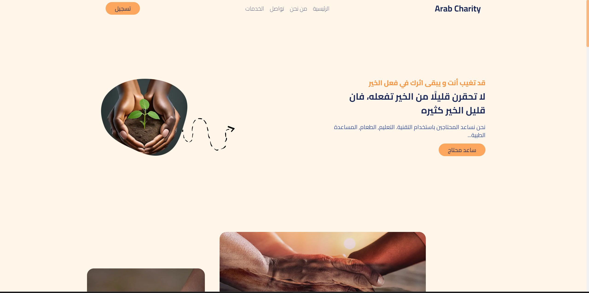
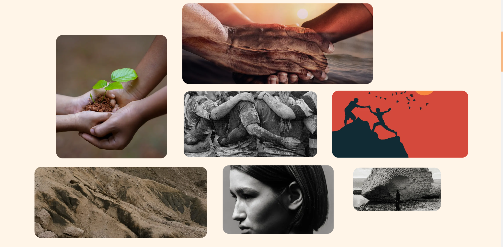
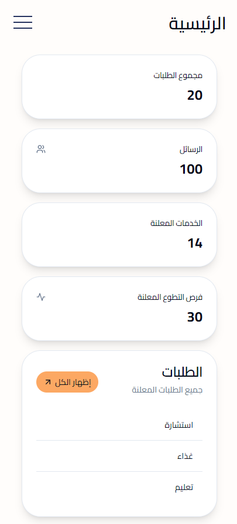

# Arab Charity: A Beacon of Hope and Compassion

## Youtube video link => https://youtu.be/AUVSi0NcYcs

| Image 1                                     | Image 2                                    |
|---------------------------------------------|--------------------------------------------|
|     |    |

Arab Charity stands as a testament to the unwavering spirit of generosity and compassion deeply ingrained in Arab culture. Rooted in the noble values of giving, solidarity, and social responsibility, Arab Charity has been a beacon of hope for countless individuals and communities in need.

Our mission is simple yet profound: to alleviate suffering, foster development, and promote a culture of empathy and support across Arab communities and beyond. Through our diverse programs and initiatives, we strive to make a tangible difference in the lives of the less fortunate and marginalized.

## Features

- **Education:** Empowering individuals through scholarships and educational centers.
- **Healthcare:** Improving healthcare infrastructure and providing medical supplies.
- **Emergency Relief:** Swift response to natural disasters, conflicts, and pandemics.
- **Donor Support:** Generous contributions from donors, partners, and volunteers.
- **Volunteering Work:** Engaging volunteers in various projects and initiatives.
- **Helping the Poor:** Providing essential support and resources to impoverished individuals.

None of this would be possible without the generous contributions of our donors, partners, and volunteers. Their unwavering support fuels our mission and inspires us to continue making a positive impact on society.

Together, we are building a brighter tomorrow, where compassion, solidarity, and hope shine ever brighter. Join us in our journey towards a more equitable and compassionate world. Together, we can make a difference that lasts a lifetime.

| Image 1                                     | Image 2                                    |
|---------------------------------------------|--------------------------------------------|
|     |    |

